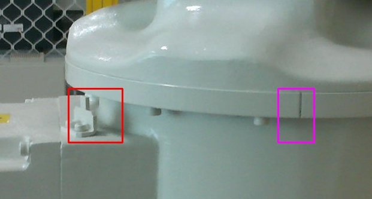

# Object Recoginition using CNN

This project uses CNN to detect certain shapes/markers in the images. Basic purpose of this project was to detect two markers(A groove and a notch) on a robot(ABB IRB-120) which has to be matched for caliberation. These markers are usually hard to find on the robots and it requires prior knowledege of the markers actually look like. This problem was solved using a trained CNN which was train using multiple images of the markers and was improved with several test runs.

The target was very specefic in this case however it can be used for general object recoginition as well.


### Tech

Open Source libraries used:

* [Theano] - python based AI library.
* [Lasange] - Python library to build theano networks
* [CUDA] - For training.

### Structure
```
|-- LICENSE
|-- README.md
|-- test_images
|-- test.py
|-- train
|   |-- neg
|   |   |-- 30.08frame111.jpg
|   |   |-- 30.08frame17.jpg
|   |   `-- 3.jpg820.1020.jpg
|   `-- positives
|       |-- 123grooveframe76.jpg
|       `-- 123grooveframe77.jpg
|-- trained_model.save
`-- train.py
```

Train directory has two child directories.
- Positives- marked with label 1 and is detected positively by code
- Neg- marked with label 0 and is discarded by code.

This structure can be modified to detect multiple objects by adding more directories containing training images for the respective objects.
Like wise labels has to be appended in code.

Once the model is generated it is saved as a binary file for future use.

Test.py takes an image of 1920 * 1080 for scanning and scans the image frame by frame which is divided in 60*60 chunks. It assumes that the features are in centre box according to rule of thirds.

### Results



License
----

Apache 2.0

   [Theano]: <http://deeplearning.net/software/theano/>
   [Lasange]: <https://github.com/Lasagne/Lasagne>
   [CUDA]: <https://www.nvidia.com/object/cuda_home_new.html>
